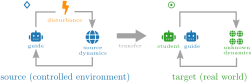

# Robust Transfer of Safety-Constrained Reinforcement Learning Agents 

This repository provides code and instructions for training agents under action
disturbances for a safe and robust transfer between environments with different
dynamics, preventing safety violations after the transfer.

<center>
    
</center>

## Installation

This code builds up on [OmniSafe](https://github.com/PKU-Alignment/omnisafe).

Clone `omnisafe`:
```sh
git clone https://github.com/PKU-Alignment/omnisafe
```

Clone this repository:
```sh
git clone https://github.com/ai-fm/safe-and-robust-transfer
```

Add the source code from this project to `omnisafe`:
* Copy the files in `./safe-and-robust-transfer/src/algorithms/` into
`./omnisafe/omnisafe/algorithms/`, and include these algorithms in
[`./omnisafe/omnisafe/algorithms/__init__.py`](https://github.com/PKU-Alignment/omnisafe/blob/main/omnisafe/algorithms/__init__.py).
* Copy the files in `./safe-and-robust-transfer/src/configs/` into `./omnisafe/omnisafe/configs/`
* Copy the files in `./safe-and-robust-transfer/src/envs/` into `./omnisafe/omnisafe/envs/`.

Done! Now the project can be installed with
```sh
cd omnisafe
pip install -e .
```

Please take a look at the [OmniSafe installation
instructions](https://github.com/PKU-Alignment/omnisafe/tree/main?tab=readme-ov-file#installation)
for more details.

## Running

All scripts are located in `src/scripts/`:

### Training the guides

`src/scripts/train/train_guides.py` trains the guides.
* Use `DDPGNoise` to train a guide with random noise.
* Use `DDPGAdversarial` to train a guide with adversarial perturbations.
* Use `SACLag` to train a guide with entropy maximization.

Environment options are `SafetyPointGuide1-v0`, `SafetyPointGuide2-v0`, and
`SafetyPointGuide3-v0`.

### Training the students

`src/scripts/train/train_students.py` trains the students.

* Use `SaGuiCS` if the guide is nondeterministic (SAC).
* Use `SaGuiCSDet` if the guide is deterministic (DDPG).

Environment options are `SafetyPointStudent1-v0`, `SafetyPointStudent2-v0`, and
`SafetyPointStudent3-v0`.

### Robustness

`src/scripts/robustness` measures the robustness of an agent.

Make sure to provide:
1. A `config.json` file.
2. A `torch_save/{MODEL_FNAME}` file, where `MODEL_FNAME` usually looks like
   `epoch-XXX.pt`.

## License

This code is licensed under the terms of the Apache License.
